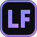

<div align="center">



# Luis Felipe Caldarelli — Portfólio

**Desenvolvedor Backend** · Java · Spring Boot · Delphi · Oracle SQL · APIs REST

[](https://github.com/C4LD4R3LL1/PortfolioPessoal/actions/workflows/deploy.yml)


### [🌐 c4ld4r3ll1.github.io/PortfolioPessoal](https://c4ld4r3ll1.github.io/PortfolioPessoal/)

</div>

---

## ✨ Destaques

Portfólio de página única, feito **à mão com HTML, CSS e JavaScript puro** — sem framework, sem build, sem `node_modules`.

| | Recurso | Como funciona |
|---|---|---|
| 🧭 | **Layout de rolagem curta** | No desktop, a identidade fica fixa à esquerda e só o conteúdo rola à direita. No mobile, vira um *dock* flutuante na base da tela. |
| 🎬 | **Revelação ao rolar** | Cada bloco surge com *fade + blur* escalonado via `IntersectionObserver`. |
| 📊 | **Barra de progresso** | Indicador de leitura no topo usando *scroll-driven animations* (CSS nativo, zero JS). |
| 🔦 | **Spotlight** | Um brilho segue o cursor pela página e pelas bordas dos cards. |
| 🗂️ | **Experiência em abas** | Abas acessíveis (setas do teclado) com indicador deslizante. |
| 🧩 | **Filtro de projetos** | O grid se reorganiza animado com a **View Transitions API**. |
| 🌗 | **Tema claro/escuro** | Transição circular a partir do botão; respeita a preferência do sistema e lembra a escolha. |
| 🔄 | **Dados ao vivo** | Número de repositórios e estrelas vêm da API do GitHub (com *fallback* estático). |
| 📋 | **Copiar e-mail** | Um clique copia o e-mail com *toast* de confirmação. |
| ♿ | **Acessível** | *Skip link*, foco visível, ARIA nas abas/filtros e respeito a `prefers-reduced-motion`. |

## 📑 Seções

1. **Sobre** — resumo, métricas em *bento grid*, formação (UniFil) e idiomas
2. **Experiência** — Solus Saúde, NX Multiserviços e Gpo Assessoria Contábil
3. **Projetos** — 8 repositórios em destaque, filtráveis por categoria
4. **Stack** — tecnologias agrupadas e certificações
5. **Contato** — e-mail, LinkedIn e GitHub

## 💻 Rodando localmente

Qualquer servidor estático serve:

```bash
python -m http.server 8000
```

Depois acesse `http://localhost:8000`.

## 🚀 Deploy

Cada push na `main` publica automaticamente no **GitHub Pages** via [`deploy.yml`](.github/workflows/deploy.yml).

Configuração única: **Settings → Pages → Build and deployment → Source: GitHub Actions**.

## 🎨 Personalização

| O quê | Onde |
|---|---|
| Cores, fontes, raio dos cards | Variáveis no topo de `styles.css` (`:root` e `[data-theme="light"]`) |
| Projetos | Array `projectsData` em `script.js` (`tags` define o filtro) |
| Textos, experiência, stack, certificações | `index.html` |
| Favicon | `favicon.svg` |

## 📁 Estrutura

```
PortfolioPessoal/
├── index.html        # Estrutura e conteúdo
├── styles.css        # Tema, layout e animações
├── script.js         # Interações e dados dos projetos
├── favicon.svg       # Ícone "LF"
└── .github/workflows/
    └── deploy.yml    # Deploy no GitHub Pages
```

## 📬 Contato

[](https://www.linkedin.com/in/luis-felipe-ferreira-caldarelli-539906251/)
[](https://github.com/C4LD4R3LL1)
[](mailto:luisfelipecaldarelli77@gmail.com)
